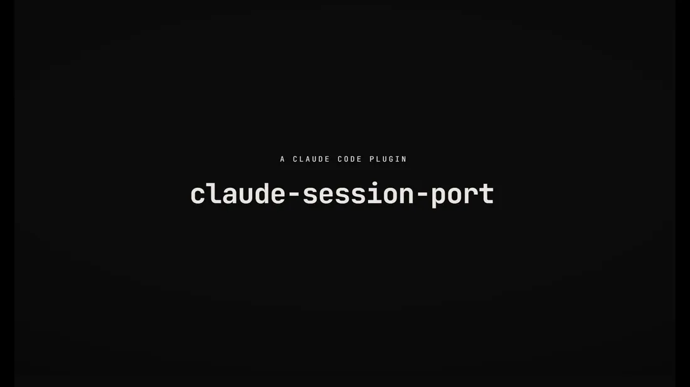

# claude-session-port

**Portable single-session export for Claude Code - no cloud, no account, just an archive.**

[](LICENSE)


Four native Claude Code slash-commands to **list, export, import, and delete** a single
Claude Code session by its UUID - so you can carry one conversation from one machine to
another, resume it, and keep your local session folder tidy. It moves *one session as a
plain `.tar.gz` file*; you move that archive however you like (USB, shared drive, chat).
Nothing is uploaded anywhere.

```text
/resume_title_uuid              # which session is which? (maps a /resume row -> UUID)
/export_uuid <uuid> <folder>    # archive one session for transport
/import_uuid <archive>          # land it on the other machine so /resume finds it
/delete_uuid <uuid> [--hard]    # prune a local session (native trash or permanent)
```



*Want sharper detail? [Download the full-resolution MP4](https://github.com/TomSOhm/claude-session-port/releases/download/v0.2.0/claude-session-port.mp4).*


> ⚠️ **Status: v0.2.0 is new and not yet battle-tested in everyday real-world use. Treat it
> as beta.**
>
> **Verified:** the cross-OS file mechanics - path encoding, home remap, `manifest.json`,
> `.tar.gz` create/extract with real `tar`, and the trash fallback - pass automated tests on
> **Windows, macOS, and Linux** in CI, and the maintainer has run the full
> `export -> import -> /resume` round-trip on **Windows**.
>
> **Not yet verified:** live `/resume` pickup on **macOS/Linux**, the native-trash side
> effects (Recycle Bin / Finder / `gio trash`), and a full **two-machine** transfer end to
> end. CI cannot drive the Claude Code app itself, so that last mile is unproven.
>
> Before trusting it with an important conversation: **keep the original until you've
> confirmed the copy resumes**, and please
> [report what worked or broke](https://github.com/TomSOhm/claude-session-port/issues) -
> real-world testers (especially on macOS/Linux) are exactly what this needs right now.

---

## Why this exists

Claude Code has **no built-in command to export/import a session between machines**
(open feature request: [anthropics/claude-code#18645](https://github.com/anthropics/claude-code/issues/18645)).
Sessions live on local disk as append-only JSONL transcripts:

```
~/.claude/projects/<encoded-cwd>/<uuid>.jsonl
```

...where `<encoded-cwd>` is your project's absolute path with every non-alphanumeric
character replaced by `-`. Because sessions are **indexed by absolute path**, you can't
just copy the file and have `/resume` find it - the destination has to resolve to the same
encoded folder, and you need the right UUID. This tool automates that copy + the UUID
bookkeeping for a single session.

The official [`--teleport`](https://code.claude.com/docs/en/sessions) flow only pulls a
**web** session down to the terminal (one-way), and the built-in `/export session.md`
produces a read-only transcript you **cannot resume**. Neither moves a *local, resumable*
session between two terminals.

## How it's different

Most community tools in this space continuously **sync your entire `.claude` directory**
to a cloud bucket or git remote. That's a different job. `claude-session-port` is
deliberately small:

- **Single-session granularity** - move exactly one conversation, not everything.
- **Zero infrastructure** - no account, no cloud bucket, no git remote, no keys. The
  artifact is one `.tar.gz`; you choose the transport.
- **Native slash-commands** - runs inside Claude Code, installs as a plugin.
- **Cross-OS** - thin command wrappers call one bundled, zero-dependency Node CLI, so all
  four commands work on Windows, macOS, and Linux, and a session can move in any direction.
- **The SIZE -> picker bridge** - `/resume_title_uuid` maps each `/resume` picker row to its
  UUID using file **size** (the picker shows size but not the UUID), which is otherwise
  hard to determine.

### Comparison

| Tool | Scope | Infra needed | Encryption | Cross-OS | Granularity | Resumable |
|---|---|---|---|---|---|---|
| **claude-session-port** | move 1 session | **none** (a `.tar.gz`) | your transport | Windows / macOS / Linux (home remap) | single session | ✅ |
| [claude-sync](https://github.com/tawanorg/claude-sync) | sync everything | Cloudflare R2 | E2E | ✅ (HOME remap) | whole `.claude` | ✅ |
| [claude-code-sync](https://github.com/porkchop/claude-code-sync) | sync everything | git remote | optional | ✅ | projects + history | ✅ |
| [hex/claude-sessions](https://github.com/hex/claude-sessions) | session manager | git | age (secrets) | ✅ | per session | ✅ |
| `--teleport` (official) | web → local | Anthropic web | - | n/a | one session | ✅ (one-way) |
| `/export session.md` (built-in) | share transcript | none | - | ✅ | one session | ❌ |

If you want continuous, encrypted, whole-environment sync, use claude-sync. If you just
want to hand one conversation to your other laptop, use this.

---

## Install

> **Platform:** Windows, macOS, and Linux. The commands are thin wrappers over a bundled,
> zero-dependency Node CLI (`scripts/cli.mjs`); Node >= 18 ships with Claude Code, so there
> is nothing else to install.

### Option A - as a Claude Code plugin (recommended)

Inside Claude Code:

```text
/plugin marketplace add TomSOhm/claude-session-port
/plugin install claude-session-port@claude-session-port
```

The four commands then appear under `/`.

### Option B - manual (no plugin system)

Copy the command files into your commands folder:

- **User-level** (all projects): `~/.claude/commands/`
- **Project-level** (one repo): `<repo>/.claude/commands/`

```bash
# from a clone of this repo
cp commands/*.md ~/.claude/commands/
```

They're available immediately via `/` autocomplete.

---

## Usage

All commands operate on the **current project folder** - run them from the repo directory
whose sessions you want to manage. A "UUID" can be the full id or a prefix of ≥ 8
characters.

### `/resume_title_uuid` - find which session is which

- **Args:** none
- **What it does:** lists every saved session for the current project - `UUID · size · age
  · git-branch · title` - newest first, and flags `AGENT` (subagent) rows that `/resume`
  hides.
- **Why:** the `/resume` picker shows **size** but not the **UUID**. This command is the
  bridge: match the picker row's size here to read off its UUID, then feed that UUID to
  `/export_uuid` or `/delete_uuid`.

```text
/resume_title_uuid
```
```
87ed171d-1d50-4818-9888-d996cf52cfad   1.9MB   2h ago   main          add learn history modal
b3c90a2f-...                            420KB   1d ago   feat/login    AGENT  (subagent)
match key = SIZE (== /resume). AGENT rows + the current session are hidden from /resume.
```

### `/export_uuid <uuid|prefix> <dst-folder>` - package a session

- **Args:** `<uuid|prefix>` then the destination `<dst-folder>` (may contain spaces).
- **What it does:** archives the session's `<uuid>.jsonl`, its `<uuid>/` sidecar dir (subagent
  transcripts, if any), and a `manifest.json` into `<dst-folder>/<uuid>.tar.gz`. The source
  machine's home prefix is tokenized to `${CSP_HOME}` so import can remap it.
- **Why:** produces one portable file you can move to another machine (any OS) by any means.
- **Note:** this exports the *conversation*, not your repo code - sync the code separately
  with git.

```text
/export_uuid 87ed171d C:\Users\you\Dropbox\cc-sessions
```

### `/import_uuid <path-to-uuid.tar.gz>` - land a session here

- **Args:** one path to a `.tar.gz` produced by `/export_uuid` (a legacy v0.1.0 `.zip` is
  also accepted).
- **What it does:** unpacks the session into
  `~/.claude/projects/<encoded-current-dir>/` so `/resume` can find it, detokenizing the
  source home prefix (`${CSP_HOME}`) to this machine's home. Refuses to overwrite an existing
  session of the same UUID.
- **Why:** makes an exported conversation resumable on this machine.
- **Important:** run it **from the repo directory you want to resume in** - the target
  folder is derived from the current working directory.

```text
/import_uuid C:\Users\you\Dropbox\cc-sessions\87ed171d-....tar.gz
# then:
/resume      # pick the row by its size
```

### `/delete_uuid <uuid|prefix> [--hard]` - prune a local session

- **Args:** `<uuid|prefix>`, optional `--hard`.
- **What it does:** default sends the session (and its sidecar dir) to the **OS native trash**
  (Recycle Bin on Windows, Finder Trash on macOS, `gio trash`/`trash-cli` on Linux, with a
  quarantine-folder fallback where no native trash exists) - all recoverable. `--hard` deletes
  permanently, but only after you type `yes` to confirm.
- **Why:** keep the local session list clean after exporting, or remove dead sessions.
- **Safety:** never touches your `memory` folder; aborts on an ambiguous prefix.

```text
/delete_uuid 87ed171d            # -> native trash
/delete_uuid 87ed171d --hard     # -> permanent (asks to confirm first)
```

---

## Workflow

**Move a session to another machine**

1. On the source machine, in the project directory, run `/resume_title_uuid`. It lists every
   session with its `UUID · size · age · branch · title`.
2. Pick the one you want and copy its UUID (a prefix of >= 8 chars is enough).
3. `/export_uuid <uuid> <folder>` -> writes `<folder>/<uuid>.tar.gz`.
4. Move that archive to the other machine (USB, shared drive, chat - your choice).
5. In the **same project directory** there, run `/import_uuid <archive>`, then `/resume` and
   open the session.

### Do I have to check the size?

**No - only in one situation:** when you are looking at a row in the `/resume` picker and need
to find *its* UUID (to export or delete that specific session). The picker shows size but
**hides the UUID**, and its title is derived differently from the raw prompt, so **size is the
reliable key** to line up a picker row with a `/resume_title_uuid` row (branch + age help, but
can collide).

**You can skip the size check when:**

- you already know the UUID (or ran `/resume_title_uuid`, which shows it directly);
- there is only one session in the project;
- you just imported one - `/import_uuid` prints the UUID and the landed row size, and the
  import is normally the newest row in `/resume`, so you can pick it by recency.

> Always match against the size shown by `/resume_title_uuid` **on the machine you are on**.
> After an import, the landed file is rewritten (home paths remapped), so its size can differ
> from the source machine's - but `/resume_title_uuid` and `/resume` on the destination always
> agree with each other.

---

## How it works

- **Thin wrappers over one CLI:** each `commands/*.md` is a small wrapper that parses
  `$ARGUMENTS` and runs the bundled, zero-dependency Node CLI
  (`node "${CLAUDE_PLUGIN_ROOT}/scripts/cli.mjs" <list|export|import|delete> ...`). The logic
  lives in one place and is tested on Windows, macOS, and Linux in CI.
- **Session location:** `~/.claude/projects/<encoded-cwd>/<uuid>.jsonl`, where
  `<encoded-cwd>` is the absolute project path with every non-alphanumeric character
  replaced by `-` (e.g. `C:\Users\you\my-app` -> `C--Users-you-my-app`).
- **The archive (`<uuid>.tar.gz`) contains:** `<uuid>.jsonl` (the transcript = the context),
  the optional `<uuid>/` sidecar directory (subagent transcripts), and a v2 `manifest.json`:

  ```json
  {
    "schemaVersion": 2,
    "uuid": "<uuid>",
    "sourceProjectPath": "/Users/you/my-app",
    "encodedSource": "-Users-you-my-app",
    "sourceOS": "darwin",
    "sourceHome": "/Users/you",
    "homeTokenized": true,
    "jsonlBytes": 2012664,
    "hasSidecar": true
  }
  ```

  On export the source home prefix is tokenized to `${CSP_HOME}`; on import it is
  detokenized to the destination machine's home. A legacy v0.1.0 `.zip` (no `schemaVersion`)
  is still importable and lands as-is.
- **The SIZE bridge:** the `/resume` picker displays a session's file size but not its
  UUID; `/resume_title_uuid` lists both, so size is the reliable key to match a picker row
  to its UUID.

See [docs/session-format.md](docs/session-format.md) for the full layout and caveats.

## Limitations & known issues

- **Live `/resume` pickup is verified on Windows.** The maintainer confirms the full
  export -> import -> `/resume` round-trip on Windows. On macOS and Linux the file mechanics
  (encode, home remap, manifest, `.tar.gz` create/extract, trash fallback) are verified by
  the CI matrix, but the live `/resume` pickup is community-confirmed rather than
  maintainer-confirmed - CI cannot drive the Claude Code app itself. Reports from mac/Linux
  users are very welcome.
- **Automated tests cover the building blocks, not the whole flow.** CI unit-tests the pure
  logic (encode, home remap, manifest parse, session resolution, title/branch parsing) plus a
  real-`tar` archive round-trip, on all three OSes. It does **not** yet exercise the full
  command flows end-to-end (`export`/`import`/`delete` wired together), nor the native-trash
  side effects (only the quarantine fallback is unit-tested). Those paths are checked manually
  on Windows and rely on user reports elsewhere.
- **Home-prefix remap only.** The transcript's home prefix is tokenized on export and
  remapped to the destination home on import (so paths under home read cleanly across
  usernames and OSes). Paths outside home are left as-is; resume works regardless, since the
  project folder is re-derived from the current directory.
- **Exit Claude Code before exporting.** Claude Code flushes the transcript to disk on
  exit - export the session from a *different* session (or after exiting the one you want).
- **Format fragility.** This relies on Claude Code's on-disk session format, which
  Anthropic can change between releases. Manual session copying has reportedly broken across
  CLI versions before. See [Compatibility](#compatibility) and please open an issue if a CC
  update breaks it.
- **Single session only.** This is not whole-`.claude` sync - by design.

## Compatibility

- **Node:** requires Node >= 18 (for the bundled CLI and its `node:test` suite). Node ships
  with Claude Code, so there is nothing extra to install.
- **OS:** Windows, macOS, and Linux. Archiving uses the system `tar` (bsdtar ships on
  Windows 10+, macOS, and Linux).

| Claude Code version | Status |
|---|---|
| _fill in the version you tested_ | ✅ working |

The session-storage layout is undocumented and may change. If a Claude Code update breaks a
command, please [open an issue](https://github.com/TomSOhm/claude-session-port/issues) with
your CC version.

## Roadmap

Cross-OS support, portable `.tar.gz` archiving, cross-OS native trash, and home-prefix path
remapping all shipped in v0.2.0 (see the [changelog](CHANGELOG.md)). Remaining ideas:

- **Deeper path remapping.** Today only the home prefix is remapped. Rewriting other
  machine-specific path-like strings could make scrolled-back history read even more cleanly
  (out of scope for now to avoid corrupting transcript content).
- **Wider live-resume confirmation.** Maintainer-confirmed `/resume` pickup on macOS and
  Linux (currently community-confirmed).

Contributions toward any of these are very welcome - see below.

## Contributing

Issues and PRs welcome. Good first contributions: deeper path remapping, more test fixtures
for the CLI, or compatibility reports across Claude Code versions and operating systems. See
[CONTRIBUTING.md](CONTRIBUTING.md) for the round-trip test and conventions.

## License

[MIT](LICENSE)

## Related projects & acknowledgements

- [anthropics/claude-code#18645](https://github.com/anthropics/claude-code/issues/18645) - the open export/import feature request
- [claude-sync](https://github.com/tawanorg/claude-sync) - full `.claude` sync via Cloudflare R2, E2E encrypted (the `${HOME}`-token path-remap idea is theirs)
- [claude-code-sync](https://github.com/porkchop/claude-code-sync) - git-based whole-environment sync
- [hex/claude-sessions](https://github.com/hex/claude-sessions) - session manager with deterministic UUID resume
- [Claude Code - Manage sessions](https://code.claude.com/docs/en/sessions) - official session docs
